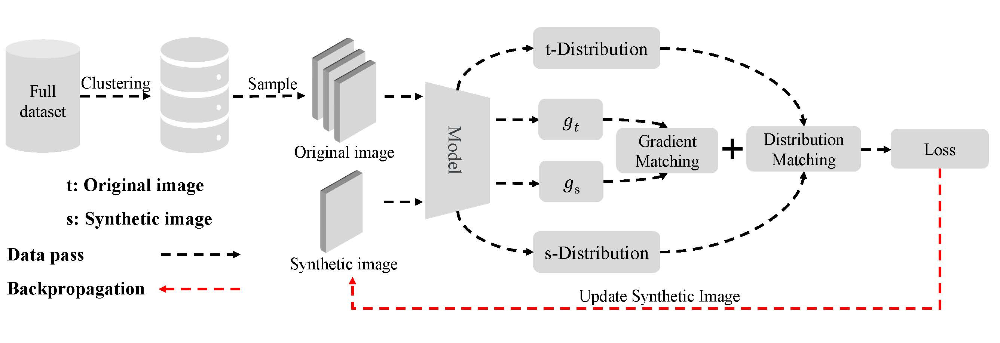
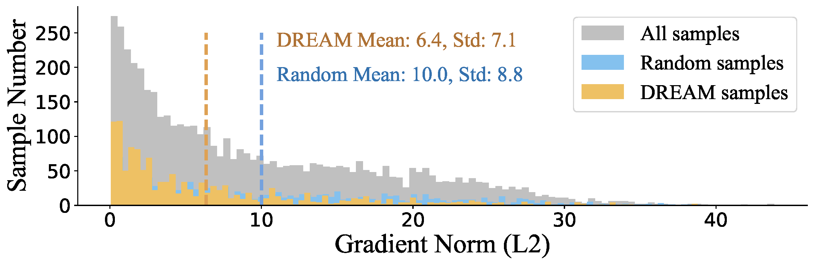
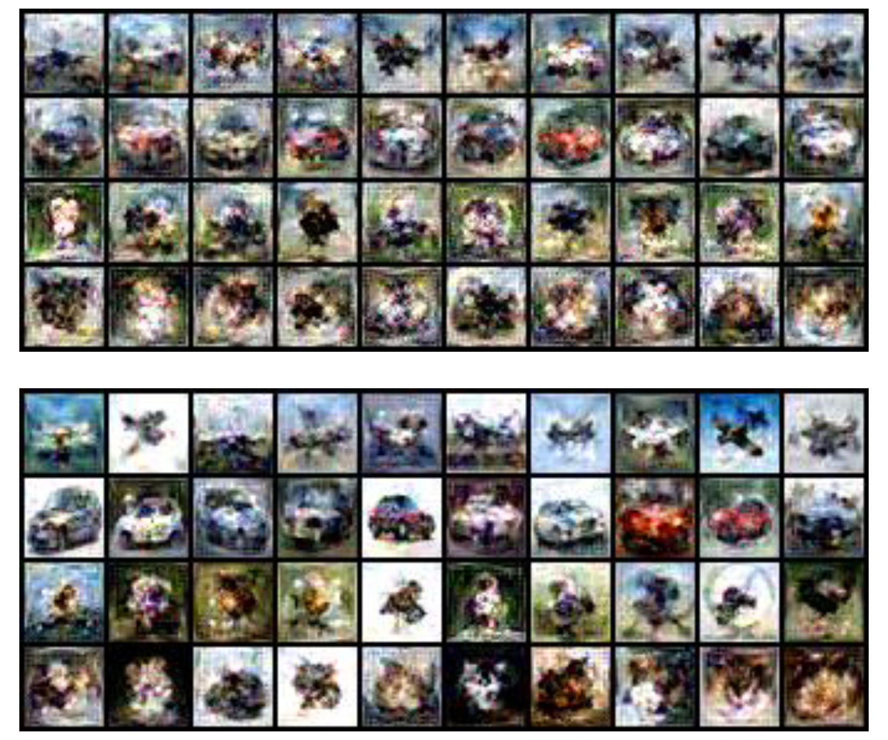
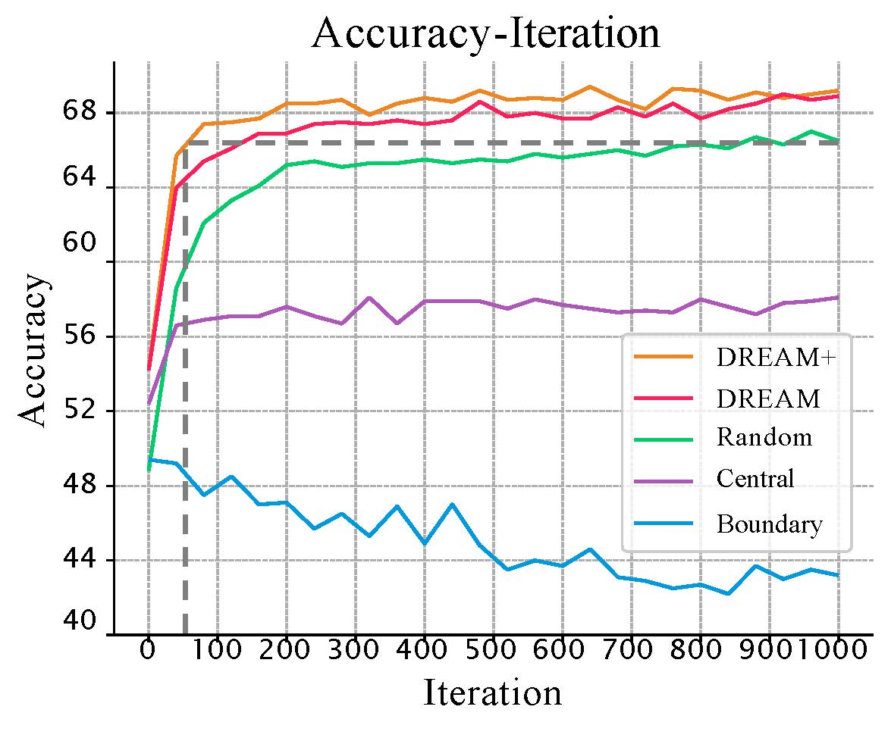

# Efficient Dataset Distillation

#12.06 update:

We released the code for "[DREAM+: Efficient Dataset Distillation by Bidirectional Representative Matching](https://arxiv.org/pdf/2310.15052.pdf)"!

Official implementation of  ["DREAM: Efficient Dataset Distillation by Representative Matching"](https://arxiv.org/abs/2302.14416), published as a conference paper at ICCV 2023.

## Abstract

<div align=center><center></center></div>

Dataset distillation plays a crucial role in creating compact datasets with similar training performance compared with original large-scale ones. This is essential for addressing the challenges of data storage and training costs. Prevalent methods facilitate knowledge transfer by matching the gradients, embedding distributions, or training trajectories of synthetic images with those of the sampled original images. Although there are various matching objectives, currently the strategy for selecting original images is limited to naive random sampling. We argue that random sampling overlooks the evenness of the selected sample distribution, which may result in noisy or biased matching targets. Besides, the sample diversity is also not constrained by random sampling. Additionally, current methods predominantly focus on single-dimensional matching, where information is not fully utilized. To address these challenges, we propose a novel matching strategy called Dataset Distillation by Bidirectional REpresentAtive Matching (DREAM+), which selects representative original images for bidirectional matching. DREAM+ is applicable to a variety of mainstream dataset distillation frameworks and significantly reduces the number of distillation iterations by more than 15 times without affecting performance. Given sufficient training time, DREAM+ can further improve the performance and achieve state-of-the-art results.

<div align=center><center></center></div>

<div align=center><center>(a) The gradient norm distribution of the plane class in CIFAR10.</center></div>

<div align=center><center></center></div>

<div align=center><center>(b) The distilled dataset comparison between DC (Upper row) and DC with DREAM strategy (Bottom row) on CIFAR-100 (plane, car, dog, cat classes).DREAM introduces more obvious categorical characteristics and variety to the distilled image.</center></div>

## Performance

The accuracy curves under different target matching samples:

<div align=center><center>
    
    </center></div>

DREAM reduces the distilling iterations by more than **8 times** without a performance drop. 

Our new work DREAM+ can reduce the distilling iterations by more than **15 times**!

## Datasets

- MNIST
- Fashion-MNIST
- SVHN
- CIFAR-10
- CIFAR-100

The datasets will be downloaded at the first running time.

## Experiment Commands

Synthesize samples with factor=2 and ipc=10 on CIFAR-10 : 
DREAM:

```
python3 condense.py --reproduce  -d cifar10 -f 2 --ipc 10
```

DREAM+:

```
python3 condense_improve.py --reproduce  -d cifar10 -f 2 --ipc 10
```


You can also modify the parameters as needed to reproduce the results on other datasets.

## Citation

```
@article{liu2023dream,
  title={{DREAM}: Efficient Dataset Distillation by Representative Matching},
  author={Liu, Yanqing and Gu, Jianyang and Wang, Kai and Zhu, Zheng and Jiang, Wei and You, Yang},
  journal={arXiv preprint arXiv:2302.14416},
  year={2023}
}
```

```
@article{liu2023dream+,
  title={DREAM+: Efficient Dataset Distillation by Bidirectional Representative Matching},
  author={Liu, Yanqing and Gu, Jianyang and Wang, Kai and Zhu, Zheng and Zhang, Kaipeng and Jiang, Wei and You, Yang},
  journal={arXiv preprint arXiv:2310.15052},
  year={2023}
}
```

