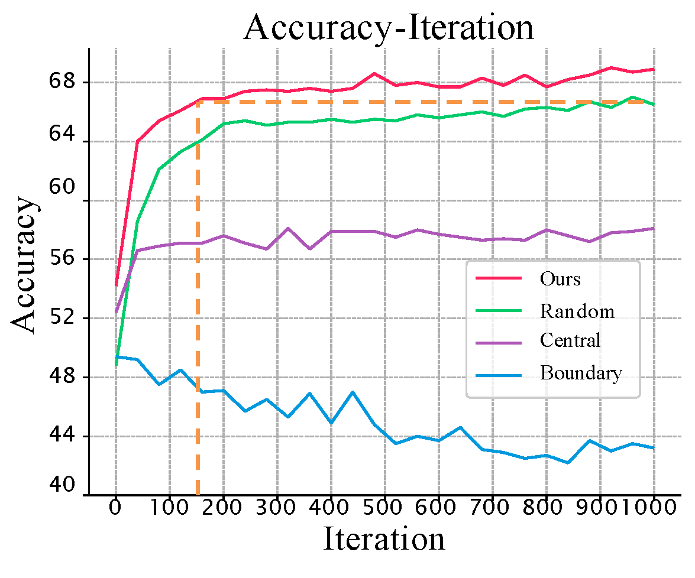

# Efficient Dataset Distillation by Representative Matching

Official implementation of  ["DREAM: Efficient Dataset Distillation by Representative Matching"](https://arxiv.org/abs/2302.14416), published as a conference paper at ICCV 2023.

## Abstract

Dataset distillation aims to synthesize small datasets with little information loss from original large-scale ones for reducing storage and training costs. Recent state-of-the-art methods mainly constrain the sample synthesis process by matching synthetic images and the original ones regarding gradients, embedding distributions, or training trajectories. Although there are various matching objectives, currently the strategy for selecting original images is limited to naive random sampling.    We argue that random sampling overlooks the evenness of the selected sample distribution, which may result in noisy or biased matching targets.   Besides, the sample diversity is also not constrained by random sampling. These factors together lead to optimization instability in the distilling process and degrade the training efficiency. Accordingly, we propose a novel matching strategy named as Dataset distillation by REpresentAtive Matching (DREAM), where only representative original images are selected for matching. DREAM is able to be easily plugged into popular dataset distillation frameworks and reduce the distilling iterations by more than 8 times without performance drop. Given sufficient training time, DREAM further provides significant improvements and achieves state-of-the-art performances. 

<div align=center><center></center></div>

<div align=center><center>(a) The gradient norm distribution of the plane class in CIFAR10.</center></div>

<div align=center><center></center></div>

<div align=center><center>(b) The distilled dataset comparison between DC (Upper row) and DC with DREAM strategy (Bottom row) on CIFAR-100 (plane, car, dog, cat classes).DREAM introduces more obvious categorical characteristics and variety to the distilled image.</center></div>

## Performance

The accuracy curves under different target matching samples:

<div align=center><center>
    
    </center></div>

It is obvious that DREAM reduces the distilling iterations by more than **8 times** without performance drop.

## Datasets

- MNIST
- Fashion-MNIST
- SVHN
- CIFAR-10
- CIFAR-100

The datasets will be downloaded at the first running time.

## Experiment Commands

Synthesize samples with factor=2 and ipc=10 on CIFAR-10 : 

```
python3 condense.py --reproduce  -d cifar10 -f 2 --ipc 10
```

You can also modify the parameters as needed to reproduce the results on other datasets.

## Citation

```
@article{liu2023dream,
  title={{DREAM}: Efficient Dataset Distillation by Representative Matching},
  author={Liu, Yanqing and Gu, Jianyang and Wang, Kai and Zhu, Zheng and Jiang, Wei and You, Yang},
  journal={arXiv preprint arXiv:2302.14416},
  year={2023}
}
```

